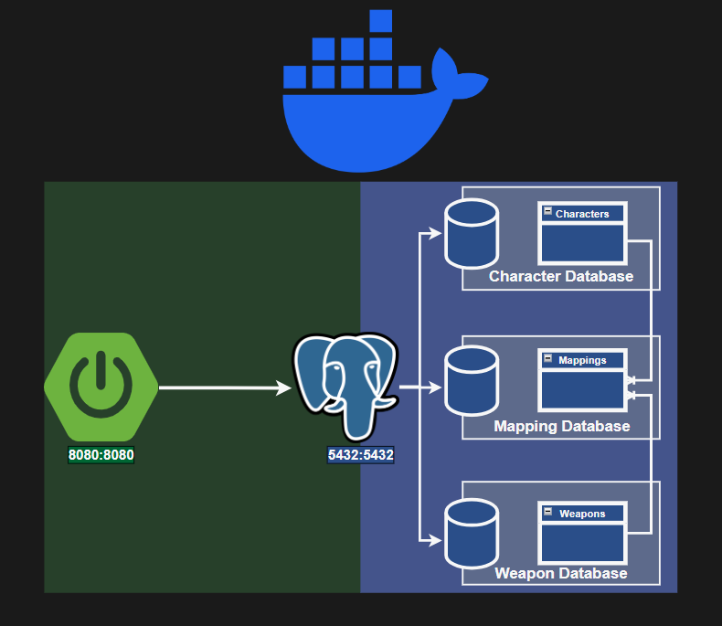

# Fighting Tracker with Distributed Transaction Scheduling

## Overview

The application uses Docker, Java Spring, and 3 Postgres Databases, each with one database.  
The synchronization between the databases is managed at the application level using Two-Phase Locking.



The API provides endpoints for managing:

- Characters
- Weapons
- Character–Weapon mappings
- Combat operations (attack, multi-attack)
- Healing operations

All endpoints are exposed under the base path:

# /submit

- **CORS**: Enabled for all origins (`*`)
- **Content-Type**: `application/json`
- **Response Type**: `application/json`
- **HTTP Status**: Always `200 OK` (business errors are returned in the response body)

---

# Response Wrapper

All endpoints return a `Result<T>` object.

## Result Structure

```json
{
  "result": { ... },
  "error": { ... }
}